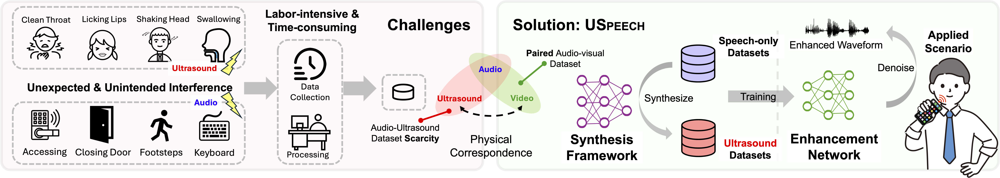

# USpeech
[](https://www.gnu.org/licenses/gpl-3.0)

Official implementation of USpeech: Ultrasound-Enhanced Speech with Minimal Human Effort via Cross-Modal Synthesis

## Abstract
> Speech enhancement is crucial in human-computer interaction, especially for ubiquitous devices. Ultrasound-based speech enhancement has emerged as an attractive choice because of its superior ubiquity and performance. However, inevitable interference from unexpected and unintended sources during audio-ultrasound data acquisition makes existing solutions rely heavily on human effort for data collection and processing. This leads to significant data scarcity that limits the full potential of ultrasound-based speech enhancement. To address this, we propose USpeech, a cross-modal ultrasound synthesis framework for speech enhancement with minimal human intervention. At its core is a two-stage framework that establishes correspondence between visual and ultrasonic modalities by leveraging audible audio as a bridge. This approach overcomes challenges from the lack of paired video-ultrasound datasets and the inherent heterogeneity between video and ultrasound data. Our framework incorporates contrastive video-audio pre-training to project modalities into a shared semantic space and employs an audio-ultrasound encoder-decoder for ultrasound synthesis. We then present a speech enhancement network that enhances speech in the time-frequency domain and recovers the clean speech waveform via a neural vocoder. Comprehensive experiments show USpeech achieves remarkable performance using synthetic ultrasound data comparable to physical data, significantly outperforming state-of-the-art ultrasound-based speech enhancement baselines. 
##
<p align="center">  </p>

> **USpeech: Ultrasound-Enhanced Speech with Minimal Human Effort via Cross-Modal Synthesis**               

---
## Setup Instructions
To get started with USpeech, follow these steps:
1. Clone the GitHub repository:
``` bash
$ git clone https://github.com/aiot-lab/USpeech.git
$ cd USpeech
$ pip install -r requirements.txt

# Install ParallelWaveGAN under the USpeech folder (https://github.com/kan-bayashi/ParallelWaveGAN)
$ git clone https://github.com/kan-bayashi/ParallelWaveGAN.git
$ cd ParallelWaveGAN
$ pip install -e .
```
2. Configure dataset paths, preprocessing parameters, and training settings in the ```config.yaml``` file.

3. Run the code in different models (synthesis and enhancement).

---

## Required Files
- Datasets
    - [LRW Dataset](https://www.robots.ox.ac.uk/~vgg/data/lip_reading/lrw1.html)
    - [LJSpeech Dataset](https://keithito.com/LJ-Speech-Dataset/)
    - [TIMIT Dataset](https://catalog.ldc.upenn.edu/LDC93S1)
    - [VCTK Dataset](https://datashare.ed.ac.uk/handle/10283/3443)
    - [Nonspeech7k Dataset](https://zenodo.org/records/6967442)

- Pretrained Models
    - [Slowonly Model](https://github.com/open-mmlab/mmaction2/tree/main/configs/recognition/slowonly)
    - [PANN Model](https://github.com/qiuqiangkong/audioset_tagging_cnn)

---

## Repository Structure
```
.
├── config.yaml
├── evaluation.py
├── preprocessing
│   ├── LRW_dataset_preprocessing.py
│   ├── collected_dataset_preprocessing.py
│   └── noisy_collected_dataset_preprocessing.py
├── synthesis.py
├── uspeech_enhancement_model
│   ├── __init__.py
│   ├── dataset.py
│   ├── loss.py
│   ├── model.py
│   ├── modules
│   │   ├── UNet.py
│   │   ├── UNet_parts.py
│   │   ├── __init__.py
│   │   └── bottleneck_transformer.py
│   └── train.py
└── uspeech_synthesis_model
    ├── __init__.py
    ├── modules
    │   ├── __init__.py
    │   ├── pann.py
    │   ├── slowonly.py
    │   ├── ultrasoundAudioModel.py
    │   ├── ultrasoundDecoder.py
    │   └── videoAudioModel.py
    ├── pretrain.py
    ├── pretrain_dataset.py
    ├── pretrain_loss.py
    ├── scheduler.py
    ├── train.py
    ├── train_dataset.py
    └── train_loss.py
```

---

## License
This project is licensed under the GNU General Public License v3.0 - see the [LICENSE](LICENSE) file for details.


